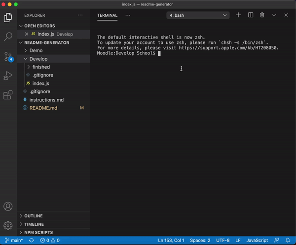
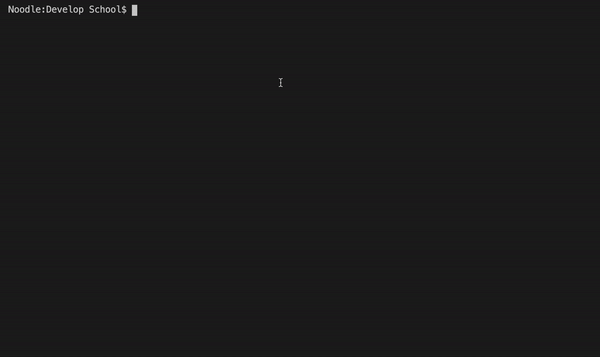
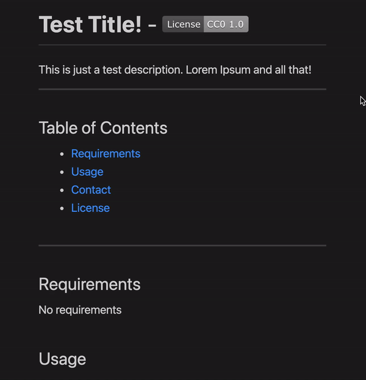

# **README Generator**  -  
    
This homework assignment for 03/06/2021 is a node.js application that allows the user to input data on the command line. The user responses are then used to generate a README document for their project! I had a lot of fun with this assignment, and hope fellow peers will find it useful. 
 
 
You can find video demos of the app [here](https://github.com/xander-deanna/readme-generator/tree/main/Demo/mov) or you can checkout the [Demo](#Demo) portion of **this** README to view some demo gifs.
 
 

    
## Table of Contents
* [Requirements](#Requirements)
* [Usage](#Usage)
* [Demo](#Demo)
* [Contact](#Contact)
* [License](#License)

 
                
## Requirements
Please make sure you have [node installed](https://nodejs.org/en/download/). You'll also need to download the [npm inquirer package](https://www.npmjs.com/package/inquirer), as this is a dependancy for the app to run. See ["Usage"](#Usage) below for more details.
 
 
            
## Usage
**README Generator** requires npm packages to run. Please make sure [node is installed](https://nodejs.org/en/download/) prior to cloning the repo. You can find instructions for installing node on the [node website](https://nodejs.org/en/download/).
* After you're sure node.js has been installed correctly, clone the [README Generator Repo](https://github.com/xander-deanna/readme-generator) locally onto your computer. Instructions on how to clone from Github can be found on [Github Docs](https://docs.github.com/en/github/creating-cloning-and-archiving-repositories/cloning-a-repository).
* Once the repo has been cloned, please navigate to the correct directory using your terminal or other command line application. 
* Type <code>npm init -y</code> into the command line, and hit <kbd>enter</kbd>.
* Next type <code>npm install inquirer</code> into the command line, and hit <kbd>enter</kbd> to [install inquirer](https://www.npmjs.com/package/inquirer).
* After inquirer has been installed, you can simply type <code>node index.js</code> and hit <kbd>enter</kbd> to start the application.
* From here, just follow the prompts in the app to generate your README doc!
 
 

## Demo
Here are a few gifs to help demonstrate the app's usage:
 

 

 

 
 
    
## Contact
Please feel free to contact me with any questions you might have, using the following information:

Email: [xander.deanna@gmail.com](mailto:xander.deanna@gmail.com)
 
Github: [https://github.com/xander-deanna](https://github.com/xander-deanna)
 

Any and all feedback is welcome! 
 
 
    
## License
This application was created by Deanna Alexander and is covered under the [Do What the F*** You Want License (WTFPL)](https://creativecommons.org/licenses/by/4.0/).
 
Copywrite © 2021
 
 
## <code>ツ</code>
 
 